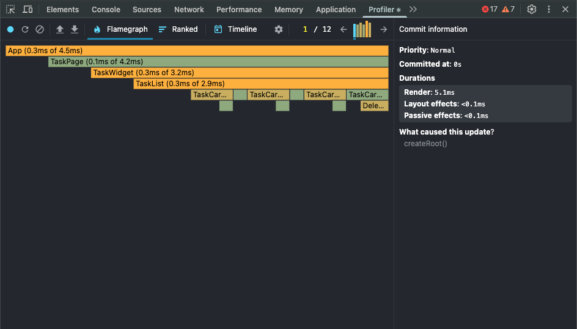

# Домашнее задание №1  
## Курс: «Разработка на ReactJS: продвинутый уровень»

### UPD 28/02: ***Внесены правки после ревью первого ДЗ***
Второе домашнее задание по курсу **«Разработка на ReactJS: продвинутый уровень»** выполнил:

**Ромашев Андрей Романович**

Тяжело реально оценить пользу данного инструмента на таком маленьком проекте. Но обязательно попробую его на рабочем. 

